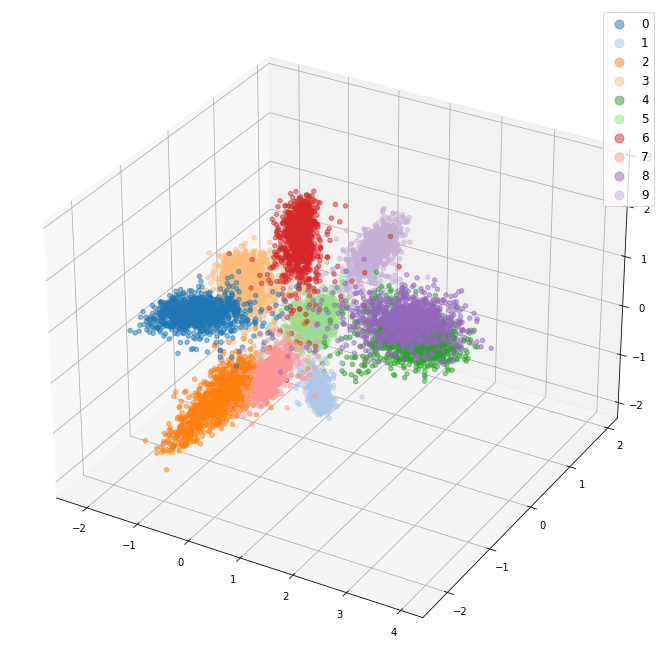

# Deep-Clustering-Technique-Analysis

## Introduction

During some reading I became really interested in the ideas behind facial regognition technology. I was listening to a video by computerphile (https://youtu.be/mwTaISbA87A) which talked about how you can't simply retrain a classification network for each new person due to how infeasible it is. In theory you could try asking your users to take a ton of different pictures of themselves at different angles, times, lightings, or maybe you could scrape social media for a database of images and then spend huge amounts of compute to train a new model everytime someone wants to use your facial regognition technology, but in practice I imagine most companies wouldn't love this solution. This is where embedding models come in, rather than classifying faces into categories of is-individual and is-not-individual we could train a network to get a picture of a face, generate some meaningful embeddings vector for that face, and compare the location of this vector to some base vector to see if its the same person. This is a cool approach becuase it means you wouldn't need to train a modle every time you have a new user, you would just need one model.

This sounds cool, but the next question is well how do we actually do this? Well there a few techniques. There are tons of methods but I will go over a few common ones here. This project uses the mnist dataset. Normally for these types of embeddings projects you would have many classes with few samples per class, but mnist has the benefit of being a simple dataset that we don't require large models to train on. I'm currently working on applying these concepts to a dataset of around 5M images of faces, but it's proving difficult as I don't have access to a great computer to work on so I'm stuck designing models to run on Kaggle TPUs in under 12 hours. Stay tuned and hopefully there will be some successful results shared in this repository for faces.

## Model Overview

### Classification

I know, I know, I said that the idea of generating meaningful embeddings was to avoid creating a classification model but stick with me. Basically we use a body, which can be just a bunch of convolutional layers. After this we can use a flatten, global average pooling, or global max pooling layer to get a vector. Next we take a head which trasforms, usually with simple fully connected layers, the vector into the number of classes in our dataset. We can then train the model on our dataset. After training if we cut the head off our model we can just stop when we have this vector and we can consider this our embeddings. 

This is the easiest to understand method, and with few classes its pretty effective. The main issue is that the softmax loss (or when we apply categorical crossentropy loss in tensorflow)  we try to maximize the output corresponding to the correct class and minimize the value corresponding to other classes. What this doesn't account for is we really care about the seperability of our embeddings, if we know most images of most people fall tightly around one spot with the other positive samples, we can be more confident that our embeddings are picking out meaningful features, overcoming the effects of angles or lighting, and packing same individuals into a relatively similar space. Softmax loss will prioritize bringing together all the positive samples, but it won't consider a prediction bad if it does not fall a certain distance away from other negative samples. This is where some of the more complex methods will come into play. At the end of the day what we really want is to not just make sure that our positive samples are clustered together, but that these clusters are tightly packed and that they have a reasonable degree of separation from other clusters in our dataset.

#### 2D Embedding Results

#### 3D Embedding Results

### Triplet Loss

The idea of triplet loss is next most simple algorithm here. There are a million sources on the internet that will give you highly technical definitions, and if you read the loss function it should be farily understandable, but my high level overview is for any given sample we want it to be closer to some positive example than it is to some negative sample. We then add in a margin, meaning that this positive example should be at least a margins length away from the negative sample, otherwise we risk miss classifying the image.

This is a decent approach, and is fairly effective at generate good embeddings. The main issue here is that you can imagine we would want a good number of samples for each individual in our dataset, otherwise we risk overfitting via the model memorizing images that should just be placed close together. For sparse datasets this method is less ideal.

#### 2D Embedding Results

#### 3D Embedding Results

### ArcFace Loss

This is where we get into the idea of angular loss functions. The idea behind these angular loss functions is that we don't just want our clusters to be found in some generic region in the embedding space, but that we care about the angle from the basis of our embeddings. This means that we are now thinking about feature correlations as some angle we get given the embeddings we have. This might be a bit confusing so let me break it down. Rather than thinking of vectors as abstract things, lets think of them as lines going around some circle. Lines that point in one general direction should tell us that there is some degree of similarity in the embeddings.

ArcFace works by creating embeddings for each image, and using the ground truth label to push it to a location in the circle. This is done by initializing some W matrix that contains the "basis vectors" for each class. This W matrix is full of trainable parameters, which means the locations of target classes, and therefore the interclass proximity of different classes, can be learned depending on the data. In the facial regognition example we would expect the Hemsworth borthers to appear closer together than we would say Chris Hemsworth and Tom Holland.

ArcFace then gets the cosine between each embedding and each class vector, this is helpful becuase cosine will be 1 if they are the same vector and -1 if they are on opposite sides from eachother. This is great, but to allow us to distinguish between different individuals we want some kind of decision bondary or empty space between classes. To acheive this we use some margin. This margin is applied directly to the angle between classes, we add some margin to the angle of the ground truth classes (reducing the cosine value). This means that as a sample we are confident in gets futher away from its ground truth class (further away in the sense of a larger angle between them), the angle between this value and any other classes must grow equally. This gives us a constant angular decision boundary between classes and can be very useful when we have sparse data with a large number of classes.

#### 2D Embedding Results

#### 3D Embedding Results

### SphereFace Loss

This is another angular loss, similar to ArcFace. The big difference here is that in simple terms we are multiplying a margin to the angular distance of the poisitive sample rather than just adding one. This might seem like a small difference but it does have some relatively large impacts on the learning of the network. With ArcFace we saw that we acheived a consistent angular margin between classes and the confidently classified samples, however when we multiply we see that there is a significantly reduced margin when the angle is small, and a significanly increaesed margin when the angular distance is large. The general idea here is that if a sample is getting relatively far away from its ground truth class vector, well it better be confident there is nothing around it that we would misclassify it for. On the other hand if a sample is extremely close to its class vector we don't require as large a margin to be confident in our predictions. 

SphereFace also has the difference that it multiplies the angular distances by the magnitude of the embeddings vector. This is why we see really long embeddings because more confident samples (with high cosine similarities to the true class and low cosine similarities to the other classes) will learn to have a higher magnitude as it minimizes the loss (-1 * big magnitude value < -1 * small magnitude value).

The advantage here is that we can get pretty good confidence information and we see that we have good decision bondary separation (especially as we move away from the class vector). A drawback is becuase of the larger margins that get implemented this can be slightly less space efficient than ArcFace in the embeddings space, and may not perform as well if there are a ton of sparse classes. That's not to say it's bad, but my understanding is that this space inefficiency is basically why ArcFace was created.

#### 2D Embedding Results

#### 3D Embedding Results

### CosFace Loss

This is the simplest loss out of the angular loss family. Here we just subtract a margin value from the cosine similarity of the ground truth class vector. This is the simplest because it doesn't involve working with the internal angle or anything. This works alright, but an issue here is that we know that the cosine function is not a linear one. If we picture our good old unit circle we know that when theta is zero, incerasing theta a bit will increase the y component far more than the x component, while at 90 degrees this same increase will disproportionatly affect the x component over the y component. Jumping back to what this means for the cosine similarity is that if we think of the margin as representing the angular delta we are giving to a point, when the vector is really close or really far from the ground truth vector the margin will have a bigger effect on the internal angle. This gives us weird quarter circles that the embeddings should fall into allowing for a smaller angular margin when a sample is near the inbetween of two classes.

#### 2D Embedding Results

#### 3D Embedding Results

### Discussion

This was a fun project, I got to learn a lot about generating embeddings for images, and how you could build a classification model for classes that you might not even have data for yet. I also got quite a bit more practice with convolutional neural networks which was fun, and working with creating custom layers in TensorFlow. These last two are things I have done before in previous projects and for work, but it's always good to get a little more practice haha.

One think that I would add, is that the direction seems to be going in creating more space effecient angular embeddings. In my opinion one way we could add on to this (and I'm sure this has been done as the above mentioned approaches are the more basic/common ones) would be to use the SphereFace style loss when an embedding is really close to the ground truth vector, and the ArcFace style loss when it gets further away. This would create a logarithmic curve looking line on the angle to angle plot between samples and their ground truth versus another class vector. This would be even more space efficient as if a cluster of samples doesn't extend very much at all in a given dimension of the embedding space, it would allow other clusters to get even closer to this one in the given dimension, reducing the amount of space needed. I might try and implement a version of this for fun here.